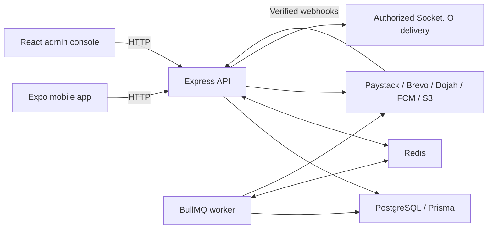

# Architecture

[Documentation index](README.md) · [Data model](DATA_MODEL.md) · [Payments](PAYMENTS.md)

## System boundaries

HireQuick runs as three applications and a separate worker process. PostgreSQL is authoritative for identity, bookings, financial records, and durable recovery. Redis supports rate limiting, scheduled jobs, and realtime delivery. Provider responses can arrive after the initiating HTTP request has completed or failed.



The diagram describes backend capabilities; it does not imply that every mobile/admin view has a live socket subscription. Current client dependencies and session behavior are covered in [Development](DEVELOPMENT.md).

## Workspace responsibilities

| Package        | Responsibility and boundaries                                                                                                                                   |
| -------------- | --------------------------------------------------------------------------------------------------------------------------------------------------------------- |
| `@hq/shared`   | Pure money/policy/state logic and Zod DTOs. No database or network access. Imported by API/mobile; the current admin manifest does not declare this dependency. |
| `@hq/database` | Prisma schema, migrations, generated types, and process-wide client singleton. Application code imports database types/client from this package.                |
| `@hq/config`   | Shared TypeScript, ESLint, and Vitest configuration. Individual packages may override defaults.                                                                 |
| `@hq/api`      | HTTP authorization, feature services, provider orchestration, ledger, realtime, worker jobs.                                                                    |
| `@hq/admin`    | React 18/Vite operations UI over the admin API.                                                                                                                 |
| `@hq/mobile`   | Expo 54, React 19.1, React Native 0.81.5, Expo Router, TanStack Query, SecureStore.                                                                             |

The root [package manifest](../package.json), [workspace definition](../pnpm-workspace.yaml), and [Turbo configuration](../turbo.json) define dependency and task behavior. TypeScript project references build shared/database outputs before their API consumer. ESM backend/shared relative imports include `.js` even in `.ts` source.

## API composition

[createApp](../apps/api/src/app.ts) accepts injected Paystack, storage, realtime, and KYC ports plus CORS, Redis rate-limiter, and proxy configuration. Tests can supply fakes and omit infrastructure. [server.ts](../apps/api/src/server.ts) is different: it constructs real `HttpPaystack`, Redis clients, realtime transport, and configured storage/KYC implementations.

Middleware order is intentional:

1. Production configuration guard; proxy trust; Helmet and CORS; global rate limiting.
2. Request correlation using `x-request-id`.
3. Raw-body Paystack and Dojah webhooks, before JSON parsing.
4. JSON parsing with a 1 MiB limit; `/health`; feature routers.
5. Not-found and error serialization middleware.

The global rate limiter runs before request-ID middleware, so early failures are not guaranteed a request ID. Paystack HTTP routes mount when a port is supplied; its webhook also needs a secret. Events always mount, but confirm requires a payment port. The Dojah webhook mounts with the selected KYC port.

`env.ts` applies strong-secret and provider requirements to staging and production. `createApp` additionally rejects production without CORS origins or a rate-limit Redis client. These checks establish configuration presence, not service connectivity. See [Configuration](CONFIGURATION.md).

## Feature map

| Module                     | Responsibilities                                                                                           |
| -------------------------- | ---------------------------------------------------------------------------------------------------------- |
| `auth`                     | OTP issuance/verification, access JWTs, refresh rotation/denylist, role middleware                         |
| `events`                   | Event editing, applications/invitations, schedule eligibility, staffing, venue masking                     |
| `bookings`                 | Confirmation, attendance, completion, cancellation, disputes, reviews                                      |
| `payments`                 | Checkout recovery, durable provider operations, bank/withdrawal services, ledger, reconciliation, webhooks |
| `profile`, `ushers`        | Profile writes, photo/availability management, discovery and public profile views                          |
| `verification`             | Document and biometric verification, provider callbacks, admin review                                      |
| `privacy`, `legal`         | Export/erasure, consent and versioned policy acceptance                                                    |
| `notifications`, `rewards` | Notification inbox/delivery; milestone unlocks and fulfillment                                             |
| `storage`, `realtime`      | Private object access, chat persistence/authorization, live signals                                        |
| `admin`, `audit.ts`        | Operational actions, two-admin approvals, hash-chained audit records                                       |
| `jobs`                     | BullMQ schedules and recovery/retention/reconciliation wrappers                                            |

See the [API reference](API.md) for links to each router.

## Confirmation and payment recovery

```mermaid
sequenceDiagram
  participant C as Client
  participant A as API
  participant D as PostgreSQL
  participant P as Paystack
  C->>A: Confirm accepted applications + idempotency key
  A->>D: Lock eligibility; persist order, bookings, checkout
  A->>D: Persist initialization attempt
  A->>P: Initialize original charge reference
  P-->>A: Checkout URL or uncertain result
  A-->>C: Durable checkout state
  P->>A: Signed charge callback
  A->>D: Record HOLDs or late-payment refund intents
  C->>A: Read checkout after browser return
  A->>P: Verify original reference if needed
  A-->>C: Authoritative checkout snapshot
```

A browser return is not proof of payment. Both verified provider reads and authenticated callbacks can resolve an outcome. Initialization uncertainty is retained as `REVIEW`; it does not authorize a second charge. Expiry needs conclusive unpaid evidence or proof that dispatch never occurred. Late success for an expired checkout enters refund recovery without confirming staff.

Financial external operations persist intent before dispatch and retain provider success separately from ledger recording. Network calls occur outside financial transactions. The worker resumes recoverable work using the original reference. [Payments](PAYMENTS.md) explains the invariants and retry boundaries.

## Transactions and ownership

`payments/ledger/ledger.ts` owns ledger and wallet balance mutations. Caller-provided Prisma transactions, row locks, advisory locks where required, and state guards serialize conflicting operations. Business services must use this boundary instead of directly editing balances.

The [shared transition tables](../packages/shared/src/state-machines.ts) describe allowed moves. A completed booking becoming `PAID` means wallet credit, not bank receipt. Post-payout disputes are currently blocked pending a clawback model. Read [Current status](STATUS.md) before interpreting broader specification promises.

## Authentication and realtime

OTP login returns access and refresh tokens. Refresh atomically consumes the old refresh JTI, signs a successor pair, and writes audit evidence. Logout revokes the presented refresh token. There is no family-wide refresh revocation; a lost committed refresh response requires signing in again. HTTP requests verify access credentials and current account status.

Sockets require a session-bound access token. Incoming actions and outgoing private deliveries recheck session/account/role authorization. Booking messages additionally require current party and booking-state access. New API and worker realtime transport uses authorized application envelopes over Redis, rather than direct Redis adapter broadcasts. Mixed transport versions can lose signals; deploy API and worker together.

Realtime is best effort. Redis outages do not authorize bypass delivery or provide replay. Clients recover state over HTTP. See the maintained [realtime authorization note](../apps/api/src/realtime/README.md) for limits, revocation timing, and test boundaries.

## Worker and integrations

[worker.ts](../apps/api/src/worker.ts) registers schedules and starts a worker on `hirequick-jobs`. It handles SIGTERM/SIGINT by draining worker and queue. It uses the same database/provider configuration as the API and publishes guarded realtime envelopes. The full job table and incident actions are in [Operations](OPERATIONS.md).

External adapters are implementation boundaries, not evidence of configured infrastructure:

- Paystack: real HTTP implementation in the server; in-memory implementation in tests.
- Brevo: SMS or configured WhatsApp OTP, plus notifications. Development login requires real delivery.
- Dojah: biometric KYC; no-op adapter when absent in development/tests.
- Storage: S3-compatible presigned uploads/downloads. Upload-url routes fail when storage is absent; some legacy profile paths permit passthrough values.
- FCM: enabled by a complete service-account configuration; notification records and push delivery are separate concerns.

## Design tradeoffs

Append-only ledgers preserve financial history at the cost of explicit compensating entries. Durable payment intents tolerate crashes but can leave ambiguous provider outcomes requiring operator investigation. Shared contracts reduce drift, but some route schemas remain local and must be read alongside shared DTOs. Best-effort realtime reduces coupling to client connections, while requiring HTTP refetch and explicit client recovery.

The source review is not a production readiness assessment. [Status](STATUS.md), [Testing](TESTING.md), and [Deployment](DEPLOYMENT.md) identify the remaining verification boundaries.
