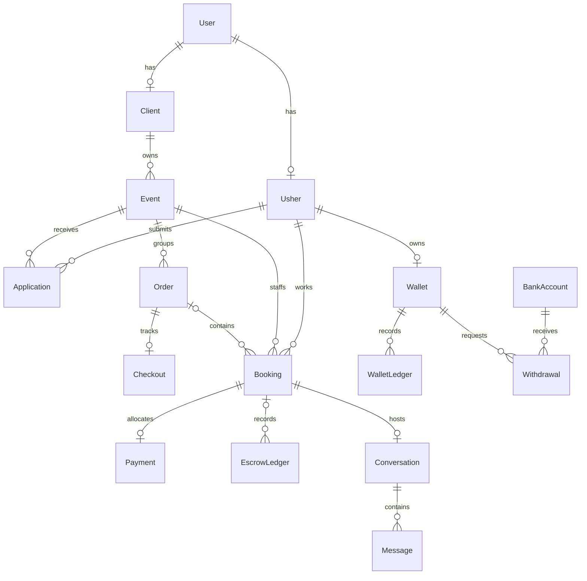

# Data model and persistence

[Documentation index](README.md) · [Architecture](ARCHITECTURE.md) · [Payments](PAYMENTS.md)

The authoritative physical model is [schema.prisma](../packages/database/prisma/schema.prisma), with deployment history in [migrations](../packages/database/prisma/migrations). This guide explains ownership and relationships; it is not a replacement field-by-field schema.

## Core relationships

This diagram intentionally omits secondary relations. Order membership is nullable on legacy bookings; platform commission entries have no booking. A current confirmation creates one order and one booking per selected usher, with one checkout per order and one payment allocation per charged booking.

## Model catalogue

| Area                 | Models                                                                  | Purpose                                                                           |
| -------------------- | ----------------------------------------------------------------------- | --------------------------------------------------------------------------------- |
| Identity             | `User`, `Client`, `Usher`                                               | Auth identity plus role-specific profile; status gates active access              |
| Verification/profile | `UsherVerification`, `Photo`, `Availability`                            | Document/biometric evidence, portfolio, per-day availability                      |
| Recruitment          | `Event`, `Application`, `Invitation`, `SavedJob`                        | Client staffing demand and usher selection                                        |
| Checkout             | `Order`, `Checkout`, `Booking`, `Payment`                               | Batch gross amount, durable checkout attempt, per-usher obligation and allocation |
| Financial history    | `EscrowLedger`, `Wallet`, `WalletLedger`, `BankAccount`, `Withdrawal`   | Held funds, released balance, bank destinations and transfers                     |
| Recovery             | `PaymentOperation`, `IdempotencyKey`, `Approval`                        | Durable intent/reference, saved replay result, maker-checker decisions            |
| Communication        | `Conversation`, `Message`, `Notification`, `DeviceToken`                | Booking chat, inbox records and push registrations                                |
| Trust/feedback       | `Dispute`, `Review`                                                     | Evidence-driven dispute handling and two-way reviews                              |
| Security/privacy     | `VerificationCode`, `RevokedToken`, `ConsentRecord`, `PolicyAcceptance` | OTP verifiers, consumed/revoked refresh IDs, consent, version acceptance          |
| Audit                | `AuditLog`, `AuditChainHead`                                            | Append-only hash-chained history and serialized chain head                        |
| Rewards              | `MilestoneTier`, `UsherMilestone`                                       | Configured thresholds and individual unlock/fulfillment state                     |

## Identifiers, money, and time

Most entity IDs are UUIDs; a refresh denylist uses its token JTI and idempotency records use their request key. Do not treat every relation-looking scalar as a database foreign key: audit actor references deliberately remain historical values, and some recovery metadata lives in JSON.

Amounts and balances are signed 32-bit PostgreSQL `Int` kobo. A valid JavaScript integer can still exceed the database limit. [Shared money helpers](../packages/shared/src/money.ts) and ledger guards validate bounds, including aggregate event/order amounts. Rating/other non-money fields have their own types; the integer rule applies to money.

Event calendar dates and `HH:MM` start/end strings are distinct from recorded instants such as `createdAt` and attendance timestamps. Avoid introducing browser-local date conversions into lifecycle decisions. Use the existing event time helpers and tests; document any timezone-model change explicitly. State-transition timestamps do not imply that a provider bank settlement happened at the same instant.

## Durable financial state

- `Order.status` tracks charge/refund lifecycle. An expired checkout does not require an invented EXPIRED order status.
- `Checkout.state` tracks CREATED, INITIALIZING, READY, REVIEW, EXPIRED, PAID, REFUND_PENDING, REFUNDED, with original reference, attempt time, expiry, and recoverable URL.
- `Booking.status` tracks each staff obligation. `Payment.escrowStatus` separately tracks HELD/FROZEN/RELEASED/REFUNDED funds.
- `PaymentOperation` stores orchestration metadata, not money. PENDING, PROVIDER_OK, RECORDED, and FAILED distinguish external intent, known success, local recording, and terminal failure.
- `IdempotencyKey` can store the original result for replay. Its response format and ownership/payload binding must stay compatible with existing retries.
- `Approval` separates PENDING, APPROVED, REJECTED, and EXECUTED. Approval is not evidence that a provider side effect has completed.

Read [Payments](PAYMENTS.md) for signed entry semantics and allowed booking/order/withdrawal transitions. Never derive balance by summing operation payloads or assuming every PAID booking represents a bank transfer.

## Integrity rules

The ledger engine is the sole application writer of escrow/wallet entries and balances. Every financial write uses the appropriate caller transaction, locks, bounds checks, and transition guard. Ledger rows remain append-only; corrections require supported compensating entries. Do not run administrative SQL to update/delete financial history.

Uniqueness protects identities, per-user profile ownership, one checkout per order, one payment per booking, and recovery dedupe keys. Recruitment and staffing also require service-level locks and eligibility checks; a schema constraint alone does not encode all schedule/capacity rules.

Audit rows preserve actor references without a live foreign-key mutation so erasure cannot silently rewrite hash-covered history. The singleton audit-chain head serializes writers. Legacy unchained audit rows are distinct from chained records; see the [audit module](../apps/api/src/modules/audit/README.md).

## Schema evolution

1. Read the affected PRD/TRD section and inspect current migrations.
2. Edit Prisma schema and generate a new migration on disposable/development storage with `pnpm db:migrate`.
3. Review SQL for data loss, nullability changes, backfills, indexes, and old/new application compatibility.
4. Run `pnpm db:generate`, build consumers, apply tracked migrations to isolated storage, and run the drift guard and relevant tests.
5. Ship schema, migration, contract, recovery compatibility, and documentation changes together.

Use `pnpm db:deploy` for release. Never rewrite an applied migration to make a shared database appear current. `db:push` is a local experiment, not migration history. Durable JSON payload changes need compatibility handling even when Prisma's schema is unchanged.

## Privacy and recovery

Account erasure pseudonymizes current profile data and retains financial/audit evidence. The retention worker handles selected transient records and storage objects, not ledgers. See [Security](SECURITY.md) for implementation limitations and linked policy records.

A database restore must include reconciliation with external provider transactions; restoring rows does not undo completed transfers. Follow [Operations](OPERATIONS.md) before resuming payment processing.
