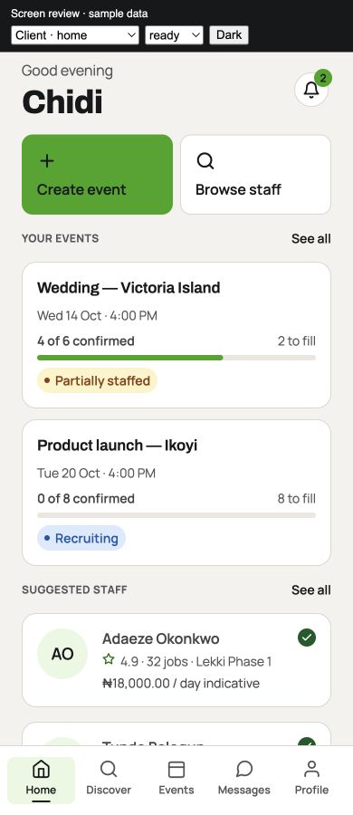
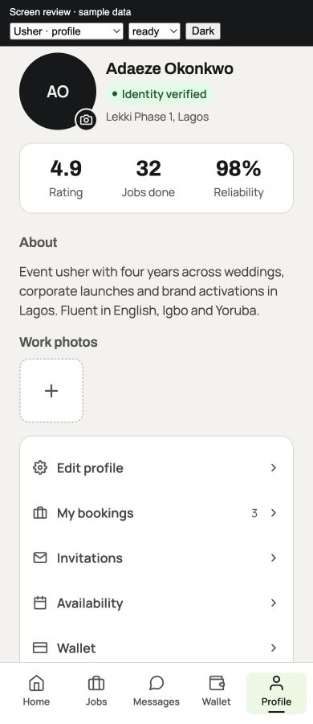
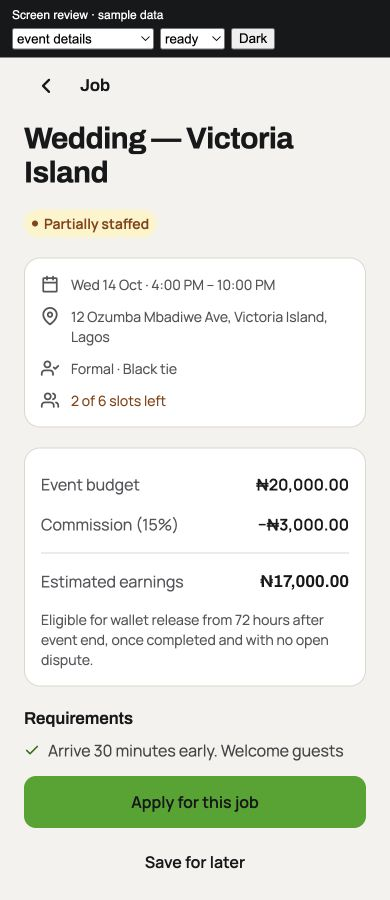
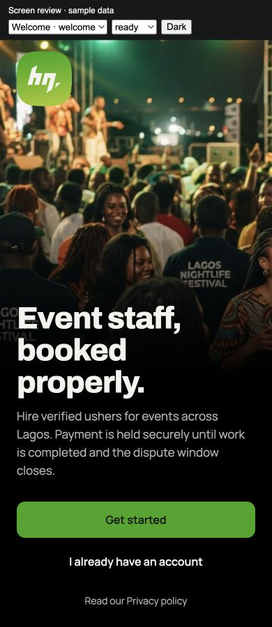
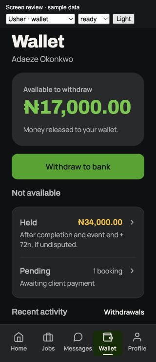

# Mobile redesign — screen implementation

Implemented from [HireQuick Redesign 2026](https://www.figma.com/design/Ep6MkJEc079aM6I0pQbwhw/HireQuick-Redesign-2026?node-id=23-2), inspected 25 September 2026. This extends the earlier foundation pass into 18 mobile screen destinations.

## Screen coverage

| Screens | Figma references | Implementation |
| --- | --- | --- |
| Welcome, role, phone, OTP | 2126:6189, 22:75, 22:104, 22:134 | Original event photo and official mark; full-bleed welcome; role selection panels; split country-code input; larger code field; bottom-aligned actions with scrolling and keyboard avoidance. |
| Client Home | 23:2 | Time-aware greeting, compact action tiles, staffing progress cards, full-width suggested staff. |
| Discover | 23:106 | Display heading, search, selected filter chips, result count and full-width staff rows. Removes an unwired Invite action; card opens the real staff profile. |
| Events | 23:207 | Active/Draft/Past controls filter authoritative event status; create action and staffing progress retained. |
| Client and usher Messages | 23:405, 31:264 | Clean avatar/name/event rows and unread counts. Actual message previews are not fabricated because the booking-list response does not supply them. |
| Client Profile | 23:471 | Identity and business information above grouped settings, support, notifications and sign-out. |
| Usher Home | 12:177 | Balance hero, upcoming confirmed/check-in/awaiting-payment work, availability shortcut. |
| Jobs | 8:94 | Available/Applied/Saved chips, estimated earnings, separate metadata rows, server-provided slot counts; save and open actions preserved. |
| Wallet | 8:2 | Separate withdrawal CTA, held/pending section, flat activity rows and lifetime total. |
| Usher Profile | 12:425 | Large identity, verification, metrics, bio, portfolio and grouped navigation; existing photo editing, upcoming jobs and reviews retained. |
| Client event detail | 23:296 | Title/status, labeled metadata card, budget card, staffing bar and persistent staff-selection action; booking, invitation, editing and cancellation entry points retained. |
| Job detail | 28:677 | Compact metadata, gross/commission/net breakdown, release explanation, requirements, sticky apply/save actions and applied/closed/unverified states. |
| Staff profile | 28:338 | Horizontal identity, metrics, portfolio/empty state, indicative-rate explanation and invite action; confirmed-booking messaging retained. |
| Booking chat | 26:359 | Green outgoing bubbles, bordered incoming bubbles, readable typography, protection notice, attachment icon and send control. Durable chat/session/send/retry behavior retained. |

## Design System Token Manager

`apps/mobile/theme/figma-tokens.json` stores Figma primitives, light/dark modes, scale values and typography. `token-manager.ts` converts percentage tracking and now exposes shared screen composition values derived from the same scale: 24px gutters, 8px top spacing, 16px section spacing and 44px touch targets. The Restyle adapters and reusable screen headings, settings rows, cards, inputs, navigation and controls consume this foundation.

Archivo and Manrope are bundled locally. The original Figma navigation SVGs and welcome artwork are bundled into both platform exports. Older font names remain registered as aliases for routes outside this screen pass.

## Deliberate adaptations and data integrity

- Primary controls use Figma's charcoal `ink/on-accent`: white on the current green has insufficient normal-text contrast. This also applies to outgoing chat text.
- Amounts retain the canonical formatter's decimal precision. Job earnings use `splitFee(kobo(gross), PLATFORM_FEE_BPS).payout`; ledger and payment behavior are unchanged.
- Wallet pending payments show the actual booking count, since the wallet response has no separate pending-payment amount. Missing staffing counts are not guessed from all bookings.
- Held-fund copy reflects the approved completion/event-end-plus-72h policy and open-dispute condition. Completion is not presented as a bank transfer.
- Operational controls such as job saving, profile photo editing, existing reviews and account settings remain reachable even when omitted in the static design's initial viewport.
- Role selection remains explicit; no account role is silently chosen.

## Validation

- Mobile TypeScript and ESLint passed.
- Android and iOS production JavaScript/assets exports passed, including the new local artwork. These are export checks, not signed binaries or installed-device tests.
- A temporary React Native Web preview imports the actual 17 non-chat screen components. Only API/auth/router/upload/environment boundaries use fixtures; the production screens and visual components are not mocked. The preview is marked as sample data and cannot submit real transactions.
- All 17 preview screens rendered at 320px with no document-width overflow. Inspected key screens at 390px and Wallet in dark mode at 320px.
- Exercised search entry and debounce, filter selection, Active/Draft/Past switching, job saving and the Saved view, role selection, valid phone entry, OTP entry, tab navigation and error retry.
- Exercised 21 loading/empty/error combinations across Home, Discover, Events, Messages, usher Home, Jobs and Wallet. Structured results are in `screen-state-checks.json`.
- The temporary preview initially lacked a toast provider and the skeleton worklet transform; both harness issues were corrected before the final checks.

Native chat interactions, VoiceOver/TalkBack, system 200% text sizing, native keyboard behavior and installed-device checks remain unverified because no simulator/Android SDK is available here. Other verification, checkout, withdrawal and management modal compositions are outside this 18-screen pass; they inherit the shared foundation but are not claimed as individually matched. Admin and marketing were not changed by this work.

## Screenshots

These show the production screen components with sample data in the review harness.

